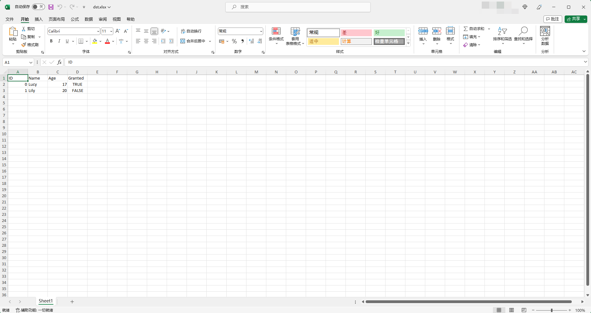

# json2excel

[](https://github.com/eaglexiang/json2excel/actions/workflows/go.yml)

Easy to convert JSON array to Excel table.

## Installing

You can build and install from source:

```shell
go install github.com/eaglexiang/json2excel@latest

```

## Usage

```shell
json2excel --if src.json --of dst.xlsx

```

```json
// src.json

[
    {
        "ID":0,
        "Name":"Lucy",
        "Age":17,
        "Granted":true
    },{
        "ID":1,
        "Name":"Lily",
        "Age":20,
        "Granted":false
    }
]

```

